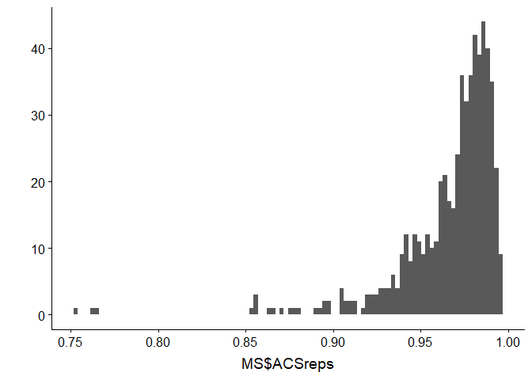
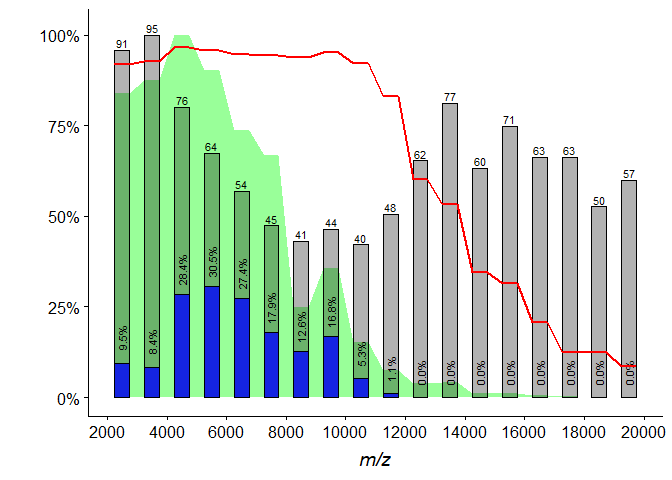

Whole-cell MALDI-TOF MS versus 16S rRNA gene analysis for identification and dereplication of recurrent bacterial isolates
================

This is an R code used for MS data manipulation and analyses done in [Strejcek et al., Front. Microbiol., 2018](https://www.frontiersin.org/articles/10.3389/fmicb.2018.01294).

Data description
----------------

49 bacterial isolates obtained from various environmental samples were analysed by whole-cell MALDI-TOF MS and 16S rRNA gene sequencing.

-   Each bacterial culture was measured by MALDI-TOF MS in triplicates and the whole process was repeated 4x times on differently inoculated cultures. Mass spectra were subjected to Bruker BioTyper microbial identification.
-   16S rRNA gene sequences were uploaded to EzBioCloud server (<https://www.ezbiocloud.net/>). Using Identify service, each culture was taxonomically classified and the closest type strain was identified.
-   Several R functions were created for this project and are accessible from ['MALDIbacteria.R'](https://github.com/user/repo/blob/branch/other_file.md) file.

### Files:

-   [MALDI-TOF spectra](https://github.com/strejcem/MALDIvs16S/blob/master/data/mzML.7z)
-   [MALDI-TOF spectra metadata](https://github.com/strejcem/MALDIvs16S/blob/master/data/metadata.tsv)
-   [16S rRNA gene sequences](https://github.com/strejcem/MALDIvs16S/tree/master/data/16S.fas)
-   [taxonomy based on 16S rRNA gene](https://github.com/strejcem/MALDIvs16S/tree/master/data/EzTaxon.tsv)
-   [main R script file](https://github.com/strejcem/MALDIvs16S/blob/master/R/MALDIvs16S.R)
-   [MALDIbacteria.R](https://github.com/strejcem/MALDIvs16S/blob/master/R/MALDIbacteria.R) - convenience functions R file

Required packages
-----------------

### CRAN packages

install.packages( c("coop", "XML", "here", "sda", "crossval", "tidyverse", "reshape2" "cowplot" ) )

### Bioconductor packages

source("<https://bioconductor.org/biocLite.R>")

biocLite( c("MALDIquant", "MALDIquantForeign", "DECIPHER", "BiocParallel" ) )

Import MS data and metadata
---------------------------

The data can be downloaded here.

``` r
library(here)
```

    ## here() starts at D:/R projects/MALDIvs16S

``` r
library(tidyverse)
```

    ## -- Attaching packages --------------------------------------------------------------------------------- tidyverse 1.2.1 --

    ## <U+221A> ggplot2 3.0.0     <U+221A> purrr   0.2.5
    ## <U+221A> tibble  1.4.2     <U+221A> dplyr   0.7.6
    ## <U+221A> tidyr   0.8.1     <U+221A> stringr 1.3.1
    ## <U+221A> readr   1.1.1     <U+221A> forcats 0.3.0

    ## -- Conflicts ------------------------------------------------------------------------------------ tidyverse_conflicts() --
    ## x dplyr::filter() masks stats::filter()
    ## x dplyr::lag()    masks stats::lag()

``` r
library(cowplot)
```

    ## 
    ## Attaching package: 'cowplot'

    ## The following object is masked from 'package:ggplot2':
    ## 
    ##     ggsave

``` r
# load convenience R functions for MS data manipulations
source(here("MALDIbacteria.R"))
```

    ## Loading required package: MALDIquant

    ## 
    ## This is MALDIquant version 1.18
    ## Quantitative Analysis of Mass Spectrometry Data
    ##  See '?MALDIquant' for more information about this package.

    ## Loading required package: MALDIquantForeign

    ## Loading required package: XML

    ## Loading required package: coop

    ## v0.986 (2018-21-Mar)

``` r
## import MS and Bruker Biotyper data
# Ms spectra from MzMl format

suppressMessages(
  s <- importMzMl(path = here("mzML"))
)

# assign name to spectra from file names
fullNames <- metaParam(s, "file")
fullNames <- str_replace(fullNames, pattern = "^.*\\\\(.*)\\.mzML$", "\\1")
s <- chngMetaParam(s, "fullName", fullNames)

# sort spectra by their full names
s <- s[order(metaParam(s, "fullName"))]

# read MS spectra metadata with BioTyper identification data
metadata <- read_tsv(here("metadata.tsv"))
```

    ## Parsed with column specification:
    ## cols(
    ##   fullName = col_character(),
    ##   culture = col_character(),
    ##   bioRep = col_integer(),
    ##   techRep = col_integer(),
    ##   taxonomy = col_character(),
    ##   taxGenus = col_character(),
    ##   taxSpecies = col_character(),
    ##   scoreValue = col_double(),
    ##   replicate = col_integer(),
    ##   preparation = col_character(),
    ##   day = col_character()
    ## )

``` r
# incorporate metadata into 'MassSpectrum' objetcs
identical(metadata$fullName, metaParam(s, "fullName"))
```

    ## [1] TRUE

``` r
for (param in names(metadata)) {
  s <- chngMetaParam(s, param, pull(metadata, param))
}
```

screen spectra for outliers
---------------------------

Process MS data with convenience function 'classicMaldi()' that wraps the suggested workflow in MALDIquant package (See the manuscript for more details). The default parameters of 'classicMaldi()' are set to the optimized values, e.g. MS range is trimmed to 4000-10000. In the manuscript, the first processing step was to look for significantly different technical replicates. Therefore, we change here the mass range back to full range of 2000-20000.

The 'classicMaldi()' computes several things at once and results are saved in individual sublist of the output object:

-   'fm' - Feature matrix. Rows are samples/spectra and columns are detected protein signals.
-   'd' - Cosine distance matrix computed from 'fm'.
-   'hc' - Hierarchical average-linkage clustering (UPGMA) based on 'd' calculated by 'hclust()'.
-   'ACSreps' - Average cosine similarity of each spectrum to its replicates. Replicates, here technical, are defined by 'replicate' metadata attribute stored in each mass spectrum object, where all replicates of the same culture have the same identifier. See MALDIquant documentation for more details on metadata attributes.

Note that the negative intensity warnings are from baseline correction step and can be ignored.

``` r
# process MS data with convenience function 'classicMaldi()' that wraps the whole
MS <- classicMALDI(s, range = c(2000, 20000))
```

    ## Warning in .replaceNegativeIntensityValues(object): Negative intensity
    ## values are replaced by zeros.

``` r
qplot(MS$ACSreps, geom = "histogram", bins = 100)
```

 We can see that the majority of the average cosine similarity of single spectra to its technical replicates have values &gt; 0.9 with 3 notable outliers with values &lt;0.85. We discard the outliers.

``` r
s <- s[-(which(MS$ACSreps < 0.85))]
```

Identify phylotype predicting protein signals by Shrinkage Discriminant Analysis
--------------------------------------------------------------------------------

The 16S rRNA gene sequences of individual cultures were used for taxonomy classification and finding the closest type strain using EzTaxon Identify service (<https://www.ezbiocloud.net/>). All MS spectra were grouped by the closest type strain identification.

``` r
EzT <- read_tsv(here("EzTaxon.tsv"))
```

    ## Parsed with column specification:
    ## cols(
    ##   culture = col_character(),
    ##   phylum = col_character(),
    ##   order = col_character(),
    ##   class = col_character(),
    ##   family = col_character(),
    ##   genus = col_character(),
    ##   species = col_character()
    ## )

``` r
species <- plyr::mapvalues(metaParam(s, "culture"),
                           from = EzT$culture,
                           to = EzT$species
                           )
```

To identify species-level phylotype-predicting mass signals, shrinkage discriminant analysis with correlation-adjusted t-score variable selection (Ahdesmaki and Strimmer, 2010) as implemented in the sda R package (Ahdesmaki et al., 2015) was carried out. The signals were detected in the whole 2 to 20 kDa mass range. All peaks were ranked on a mutual information entropy basis, and selection was controlled by the false non-discovery rate. All peaks with a local false discovery rate of less than 0.2 were selected as phylotype predictors. Prediction accuracy was estimated using 10 × 10-fold cross validation of all MS data with the aid of the crossval R package (Strimmer, 2015) as described in sda documentation.

``` r
library(sda)
```

    ## Loading required package: entropy

    ## Loading required package: corpcor

    ## Loading required package: fdrtool

``` r
MS <- classicMALDI(s, range = c(2000, 20000))
ldar <- sda.ranking(Xtrain=MS$fm, L = as.factor(species),
                    ranking.score = "entropy", fdr = TRUE, diagonal = F)
```

    ## Computing cat scores (centroid vs. pooled mean) for feature ranking
    ## 
    ## Number of variables: 1101 
    ## Number of observations: 585 
    ## Number of classes: 43 
    ## 
    ## Estimating optimal shrinkage intensity lambda.freq (frequencies): 0.5593 
    ## Estimating variances (pooled across classes)
    ## Estimating optimal shrinkage intensity lambda.var (variance vector): 0.0561 
    ## 
    ## Computing the square root of the inverse pooled correlation matrix
    ## Estimating optimal shrinkage intensity lambda (correlation matrix): 0.1037 
    ## 
    ## Computing false discovery rates and higher cricitism scores for each feature

``` r
# number of predictive signals
sum(ldar[,"lfdr"] < 0.2)
```

    ## [1] 150

``` r
# construct data frame from sda data for plotting purposes
ldadf <- data.frame(ldar[,])
ldadf$peaks <- as.numeric(rownames(ldadf))
ldadf$cutoff <- ifelse(ldadf$lfdr < 0.2, "predictive", "non-predictive")

# plot predictive vs non-predictive peaks
ggplot(ldadf, aes(peaks)) + 
  geom_histogram(aes(fill = cutoff), alpha = 1, binwidth = 250,
                 color = "black", position = "identity") +
  geom_vline(xintercept = c(4000, 10000), linetype = 5) +
  labs(x=expression(paste(italic("m/z"), "[Da]")),
       y = "count", fill = element_blank()) +
  annotate("label", x = c(4000, 10000), y = 50, label = c(4000, 10000)) +
  theme(legend.position = c(0.76, 0.9))
```


For accuracy measurement we employ the 10x10 cross-validation.

``` r
library(crossval)

#define prediction function
predfun <- function(Xtrain, Ytrain, Xtest, Ytest,
                      numVars, diagonal=F) {
    # estimate ranking and determine the best numVars variables
    ra <- sda.ranking(Xtrain, Ytrain,
                      verbose=FALSE, diagonal=diagonal, fdr=FALSE)
    selVars <- ra[,"idx"][1:numVars]
    # fit and predict
    sda.out <- sda(Xtrain[, selVars, drop=FALSE], Ytrain,
                   diagonal=diagonal, verbose=FALSE)
    ynew <- predict(sda.out, Xtest[, selVars, drop=FALSE],
                    verbose=FALSE)$class
    # compute accuracy
    acc <- mean(Ytest == ynew)
    return(acc)
  }

# extract 'culture' metada attribute from all sprectra to a vector
cultures <- metaParam(s, "culture")
cv <- crossval(predfun, X=MS$fm, Y=factor(cultures), diagonal=F, verbose=F,
               K=10, B=10,  # 10x10 cross-validation
               numVars=150)  # number of top predicting peaks to test

## Acuracy
cv$stat
```

    ## [1] 0.9996609

Next, we were interested in how several measures, such as technical and biological average cosine similarity, number of protein signals and number of phylotype-predicting signals, vary over 1kDa intervals in the whole m/z range:

``` r
# Interval for Ms ranges to be calculated
unit <- 1000
intervals <- seq(2000, 20000, unit)
iteration <- seq_along(intervals)
iteration <- iteration[-length(iteration)]

MSranges <- NULL
cumulInt <- 0
fm <- MS$fm
techReps <- metaParam(s, "replicate")
cultures <- metaParam(s, "culture") # biological replicates
fmRange <- as.numeric(colnames(fm))

for(iter in iteration) {
  bot <- intervals[iter]
  upper <- intervals[iter+1]

  predictives <- sum(ldadf$peaks >= bot & ldadf$peaks < upper &
                       ldadf$cutoff == "predictive")
  
  fmSubset <- fm[, fmRange >= bot & fmRange < upper]
  numPeaks <- ncol(fmSubset)
  Int <- sum(fmSubset)
  
  avgCosRange <- avgCos(fmSubset, techReps)
  avgCosRange <- mean(avgCosRange$meanACS, na.rm = TRUE)
  
  avgCosRangeS <- avgCos(fmSubset, cultures)
  avgCosRangeS <- mean(avgCosRangeS$meanACS, na.rm = TRUE)

  MSranges <- as.data.frame(rbind(MSranges,
                                  c(bot = bot,up = upper, numPeaks = numPeaks,
                                    Int = Int, predPeaks = predictives,
                                    ACSR = avgCosRange, ACSS = avgCosRangeS)))
}
MSranges
```

    ##      bot    up numPeaks         Int predPeaks       ACSR       ACSS
    ## 1   2000  3000       91 6.065038578         9 0.96470209 0.91928746
    ## 2   3000  4000       95 6.323682028         8 0.97144443 0.92704295
    ## 3   4000  5000       76 7.239983512        27 0.98223085 0.96536375
    ## 4   5000  6000       64 6.527272014        29 0.98539807 0.95705846
    ## 5   6000  7000       54 5.340030259        26 0.98504392 0.94501916
    ## 6   7000  8000       45 4.831819513        17 0.97742153 0.94372817
    ## 7   8000  9000       41 1.806448434        12 0.96480290 0.93859053
    ## 8   9000 10000       44 2.577665277        16 0.97554198 0.95104197
    ## 9  10000 11000       40 1.095850715         5 0.94580326 0.92217053
    ## 10 11000 12000       48 0.543323184         1 0.85838761 0.83051439
    ## 11 12000 13000       62 0.277735357         0 0.62126955 0.60054370
    ## 12 13000 14000       77 0.296708705         0 0.56353386 0.53160967
    ## 13 14000 15000       60 0.091968299         0 0.37967627 0.34452048
    ## 14 15000 16000       71 0.084989160         0 0.33611309 0.31410682
    ## 15 16000 17000       63 0.044576497         0 0.22378640 0.20668713
    ## 16 17000 18000       63 0.015754398         0 0.14465787 0.12316445
    ## 17 18000 19000       50 0.008470629         0 0.14003008 0.12581062
    ## 18 19000 20000       57 0.011137105         0 0.08913615 0.08543219

We wanted to have all information in one readable plot. To reach that, we needed a little bit more formatting. Namely, we create the anchor points for individual mass intervals by doubling specific values. Then, we employ ggplots to construct nice plot with everything together.

``` r
intenzity <- data.frame(mz = rep(MSranges$bot, each = 2),
                        Int = rep(MSranges$Int, each = 2),
                        ACSR = rep(MSranges$ACSR, each = 2),
                        ACSS = rep(MSranges$ACSS, each = 2))
intenzity$mz <- intenzity$mz + c(unit/2-unit/4, unit/2+unit/4)

# generate the plot
ggplot(MSranges, aes(bot+unit/2)) +
  geom_area(data = intenzity, aes(x = mz, y = Int/max(Int)),
            alpha = 0.4, fill = "green") +
  geom_col(aes(y = numPeaks/max(numPeaks)), width = unit/2, fill = 1,
           color = "black", alpha = 0.3) +
  geom_col(aes(y = numPeaks/max(numPeaks)), width = unit/2, fill = NA,
           color = "black", alpha = 1, size = 0.05) +
  geom_col(aes(y = predPeaks/max(numPeaks)), width = unit/2, fill = "blue",
           color = "black", alpha = 0.8, size = 0.1) +
  geom_text(aes(y = numPeaks/max(numPeaks), label = numPeaks), size = 3,
            position = position_nudge(y = 0.02)) +
  geom_text(aes(y = predPeaks/max(numPeaks), 
                label = scales::percent(predPeaks/max(numPeaks))), size = 3,
            position = position_nudge(y = 0.07), col = "black", angle = 90) +
  geom_line(data = intenzity, aes(x = mz, y = ACSS), col = "red", size = 1) +
  labs(x = expression(italic("m/z")), y = "") +
  scale_x_continuous(name = expression(italic("m/z")),
                     breaks = seq(2000, 20000, 2000),
                     minor_breaks = seq(2000, 20000, 1000)) +
  scale_y_continuous(name = "", labels = scales::percent)
```



We conclude with restricting the mass rage for further analysis to 4000-10000 m/z values. For more detail, please refer to the manuscript.

16S rRNA gene sequence analysis
-------------------------------

``` r
# read 16S data
library(DECIPHER)
dna <- readDNAStringSet(here("16S.fas"))

simil16S <- matrix(100, nrow = length(dna), ncol = length(dna), 
                  dimnames = list(names(dna), names(dna)))

# To reduce computational time
validM <- lower.tri(simil16S, diag = F)

# can be also parallelized
for (x in seq_along(dna)) {
  for (y in seq_along(dna)) {
    if(!validM[x,y]) next
    simil16S[x,y] <- pid(pairwiseAlignment(dna[x], dna[y], type = "local"),
                         type = "PID2")
  }
}

simil16S <- simil16S / 100
simil16S[upper.tri(simil16S)] <- simil16S[lower.tri(simil16S)]

# UPGMA dendrogram
plot(hclust(as.dist(1-simil16S), method = "ave"), hang=-1)
```


Preparing pairwise data for MS - 16S rRNA gene similarity relationships and finding optimal delineating thresholds
------------------------------------------------------------------------------------------------------------------

We start with 16S data:

``` r
# to discard the duplicated entries later
simil16S[upper.tri(simil16S, diag = F)] <- -1

# transform full matrix into 2-column matrix
df16S <- reshape2::melt(simil16S, varnames = c("row", "col"), as.is = TRUE)

# now discard duplicated entries
df16S <- df16S[df16S$value >= 0, ]

df16S$pair <- paste(df16S$row, df16S$col, sep = "-")
```

Continue with MS data:

``` r
# the default MS range is 4000-10000, here it is just to stress it out 
MS <- classicMALDI(s, range = c(4000, 10000), labels = "fullName")
```

    ## Warning in .replaceNegativeIntensityValues(object): Negative intensity
    ## values are replaced by zeros.

``` r
similMS <- 1-as.matrix(MS$d, dimnames = list(labels(MS$d), labels(MS$d)))
similMS[upper.tri(similMS, diag = F)] <- -1
dfMS <- reshape2::melt(similMS, varnames = c("row", "col"), as.is = TRUE)
dfMS <- dfMS[dfMS$value >= 0, ]

pairUnique <- paste(dfMS$row, dfMS$col, sep = "-")
dfMS$pair <- str_replace_all(pairUnique, "_[0-9]_[0-9]", "")
```

And now, put it together:

``` r
pairData <- merge(dfMS, df16S, by = "pair")
names(pairData) <- c("name", "nameAunique", "nameBunique", "similMS",
                          "nameA", "nameB", "simil16S") 
```

Add taxonomy information:

``` r
for (taxLevel in names(EzT)[-1]) {
  pairData[paste0(taxLevel,"A")] <-
    plyr::mapvalues(pairData$nameA, EzT$culture, EzT[[taxLevel]])

  pairData[paste0(taxLevel,"B")] <-
    plyr::mapvalues(pairData$nameB, EzT$culture, EzT[[taxLevel]])
}

# identify the lowest shared taxonomy level between the pair
pairData$taxRelation <- case_when(
    pairData$speciesA == pairData$speciesB ~ "Species",
    pairData$genusA == pairData$genusB ~ "Genus",
    pairData$familyA == pairData$familyB ~ "Family",
    pairData$classA == pairData$classB ~ "Class",
    pairData$orderA == pairData$orderB ~ "Order",
    pairData$phylumA == pairData$phylumB ~ "Phylum",
    TRUE ~ "Domain")


# add alpha chanel value for ploting purposes
pairData$alpha <- plyr::mapvalues(pairData$taxRelation,
                c("Species", "Genus", "Family", "Class", "Order", "Phylum",
                  "Domain"),
                c(0.5, 0.5, 0.3, 0.3, 0.2, 0.2, 0.1))
```

MS similarity vs 16S rRNA gene similarity relations
---------------------------------------------------

``` r
# group data by culture
dfGrouped <- group_by(pairData, name) %>%
  summarise(avgMS = mean(similMS), avg16S = mean(simil16S), sd = sd(similMS),
            relation = unique(taxRelation), alpha = as.numeric(unique(alpha)))
dfGrouped$relation <- factor(dfGrouped$relation,
         levels = c("Species", "Genus", "Family", "Class", "Order", "Phylum",
                  "Domain"))

# generate plot
ggplot(dfGrouped, aes(avgMS, avg16S*100, col = relation, alpha = alpha)) +
  geom_errorbarh(aes(xmax= avgMS + sd, xmin = avgMS - sd), alpha = 0.2) +
  scale_colour_manual(name = element_blank(),
                      values = c("red", "blue", "green", "purple", "orange",
                                 "pink", "grey")) +
  geom_point() +
  scale_alpha(guide = 'none') +
  geom_hline(yintercept = 98.65, linetype = 5) +
  geom_vline(xintercept = c(0.79, 0.92), linetype = c(2,1)) +
  annotate("label", x=c(0.13,0.79, 0.92), y=c(98.65, 78, 78),
           label = c(98.65, 0.79, 0.92))  +
  labs(x="Mass spectra cosine similarity",
       y="16S rRNA gene sequence similarity [%]") +
  theme(legend.position = c(0.5, 0.4),
        legend.background = element_rect(
          fill = "white", linetype = 1, color = 1))
```


Finding optimal cosine similarity thresholds
--------------------------------------------

To find the optimal cosine similarity thresholds we need to calculate F1 score based on the classification based on 16S rRNA gene analyses: phylotype-based (closest type strain) and similarity-based (98.65% similarity threshold). For more details, please refer to the manuscript.

Here, we coded the cross-validation manually so we could parallelized it. The inner function that computes F1-score/precision/recall/accuracy is FscPrecRecAcc() and is loaded from 'MALDIbacteria.R'

``` r
library(BiocParallel)
set.seed(123)
B <- 1
K <- 2
beta <- 1 # this defines the F-beta score

# parallelized F1 score calculation for the closest type strain (phylotype)
# classification
closestTypeF1 <- bplapply(1:B, function(B, K, beta, pairData) {
  
  source('MALDIbacteria.R')
  resultsB <- NULL
  fold <- sample(1:K, size = nrow(pairData), replace = T)
  for (h in seq(0, 0.99, 0.01)) {
    resultsK <- lapply(1:K, function(K, h) {
      Xval <- pairData[fold != K, ]
      # base thruth is: the closest type strain of culture A (speciesA) is the same
      # as the closest type strain of culture B (speciesB)
      F1train <- FscPrecRecAcc(Xval$similMS >= h,
                               Xval$speciesA == Xval$speciesB, beta = beta)
      names(F1train) <- paste0("train.", names(F1train))
      
      Xval <- pairData[fold == K, ]
      F1test <- FscPrecRecAcc(Xval$similMS >= h, Xval$speciesA == Xval$speciesB,
                              beta = beta)
      names(F1test) <- paste0("test.", names(F1test))
      
      output <- cbind(F1train[3], F1test[c(1,2,4)])
      return(output)
    }, h=h)
    
    resultsK <- do.call(rbind, resultsK)
    resultsK <- apply(resultsK, 2, mean)
    resultsK <- as.data.frame(t(c(h=h, resultsK)))
    
    resultsB <- rbind(resultsB, resultsK)
  }
  maxF <- which.max(resultsB$test.Fscore)
  return(cbind(B=B, resultsB))
}, K=K, beta=beta, pairData=pairData)

closestTypeF1 <- do.call(rbind, closestTypeF1)
closestTypeF1 <- closestTypeF1 %>%
  select(-B) %>%
  group_by(h) %>%
  summarise_all(mean)
  

# similarity based classification
similarity9865F1 <- bplapply(1:B, function(B, K, beta, pairData) {
  source('MALDIbacteria.R')
  resultsB <- NULL
  fold <- sample(1:K, size = nrow(pairData), replace = T)
  for (h in seq(0, 0.99, 0.01)) {
    resultsK <- lapply(1:K, function(K, h) {
      Xval <- pairData[fold != K, ]
      # base thruth is: 16S rRNA gene similarity >= 98.65%
      F1train <- FscPrecRecAcc(Xval$similMS >= h, Xval$simil16S >= 0.9865,
                               beta = beta)
      names(F1train) <- paste0("train.", names(F1train))
      
      Xval <- pairData[fold == K, ]
      F1test <- FscPrecRecAcc(Xval$similMS >= h, Xval$simil16S >= 0.9865,
                              beta = beta)
      names(F1test) <- paste0("test.", names(F1test))
      
      output <- cbind(F1train[3], F1test[c(1,2,4)])
      return(output)
    }, h=h)
    resultsK <- do.call(rbind, resultsK)
    resultsK <- apply(resultsK, 2, mean)
    resultsK <- as.data.frame(t(c(h=h, resultsK)))
    
    resultsB <- rbind(resultsB, resultsK)
  }
  maxF <- which.max(resultsB$test.Fscore)
  return(cbind(B=B, resultsB))
}, K=K, beta=beta, pairData=pairData)

similarity9865F1 <- do.call(rbind, similarity9865F1)
similarity9865F1 <- similarity9865F1 %>%
  select(-B) %>%
  group_by(h) %>%
  summarise_all(mean)
```

Concatenate the results into one data frame and plot the results:

``` r
dfPrecRec <- merge(closestTypeF1, similarity9865F1, by="h")

names(dfPrecRec) <- c("h", "F1.type", "prec.type","rec.type", "acc.type",
                      "F1.seq","prec.seq", "rec.seq", "acc.seq")

dfPRF <- reshape2::melt(dfPrecRec, id.vars = "h")
dfPRF <- dfPRF %>% mutate(
  Reference =
    case_when(
      grepl("type", variable) ~ "Closest Type Strain",
      grepl("seq", variable) ~ "Similarity based"
    ),
  color =
    case_when(
      grepl("F1", variable) ~ "F1 score",
      grepl("prec", variable) ~ "Precision",
      grepl("rec", variable) ~ "Recall",
      grepl("acc", variable) ~ "Accuracy"
    ),
  lineType =
    case_when(
      grepl("seq", variable) ~ "Similarity based",
      grepl("type", variable) ~ "Closest Type Strain"
    )
  )

#not symetric dataset, skewed to many POSITIVEs, accuracy is not a good performance measure
dfPRF <- dfPRF %>% filter(color != "Accuracy")


# max F1
maxType <- dfPRF %>%
  filter(variable == "F1.type") %>%
  top_n(1, value) %>%
  select(h) %>%
  summarise(h = mean(h)) %>%
  as.numeric()

maxSimil <- dfPRF %>%
  filter(variable == "F1.seq") %>%
  top_n(1, value) %>%
  select(h) %>%
  summarise(h = mean(h)) %>%
  as.numeric()


# generate plot using ggplot2
ggplot(dfPRF, aes(h, value)) +
  geom_line(aes(color=color, linetype=lineType)) +
  geom_vline(xintercept = c(maxSimil, maxType), linetype = c(2,1)) +
  annotate("label", x = c(maxSimil, maxType), y = 0.1, label = c(maxSimil, maxType)) +
  labs(x="Cosine similarity threshold",
       y="value", color = element_blank(), linetype = element_blank()) +
  theme(legend.position = c(0, 0.55),
        legend.box.background = element_rect(
          fill = "white", size = 0.5, linetype = 1, color = 1)
        ) +
  scale_color_manual(values=c(4,3,2))
```

 \#\#\# Packages' versions

``` r
sessionInfo()
```

    ## R version 3.5.1 (2018-07-02)
    ## Platform: x86_64-w64-mingw32/x64 (64-bit)
    ## Running under: Windows 10 x64 (build 16299)
    ## 
    ## Matrix products: default
    ## 
    ## locale:
    ## [1] LC_COLLATE=Czech_Czechia.1250  LC_CTYPE=Czech_Czechia.1250   
    ## [3] LC_MONETARY=Czech_Czechia.1250 LC_NUMERIC=C                  
    ## [5] LC_TIME=Czech_Czechia.1250    
    ## 
    ## attached base packages:
    ## [1] stats4    parallel  stats     graphics  grDevices utils     datasets 
    ## [8] methods   base     
    ## 
    ## other attached packages:
    ##  [1] BiocParallel_1.14.1      bindrcpp_0.2.2          
    ##  [3] DECIPHER_2.8.1           RSQLite_2.1.1           
    ##  [5] Biostrings_2.48.0        XVector_0.20.0          
    ##  [7] IRanges_2.14.10          S4Vectors_0.18.3        
    ##  [9] BiocGenerics_0.26.0      crossval_1.0.3          
    ## [11] sda_1.3.7                fdrtool_1.2.15          
    ## [13] corpcor_1.6.9            entropy_1.2.1           
    ## [15] coop_0.6-1               XML_3.98-1.11           
    ## [17] MALDIquantForeign_0.11.1 MALDIquant_1.18         
    ## [19] cowplot_0.9.2            forcats_0.3.0           
    ## [21] stringr_1.3.1            dplyr_0.7.6             
    ## [23] purrr_0.2.5              readr_1.1.1             
    ## [25] tidyr_0.8.1              tibble_1.4.2            
    ## [27] ggplot2_3.0.0            tidyverse_1.2.1         
    ## [29] here_0.1                
    ## 
    ## loaded via a namespace (and not attached):
    ##  [1] httr_1.3.1               bit64_0.9-7             
    ##  [3] jsonlite_1.5             modelr_0.1.2            
    ##  [5] assertthat_0.2.0         blob_1.1.1              
    ##  [7] cellranger_1.1.0         yaml_2.1.19             
    ##  [9] pillar_1.2.3             backports_1.1.2         
    ## [11] lattice_0.20-35          glue_1.2.0              
    ## [13] digest_0.6.15            rvest_0.3.2             
    ## [15] colorspace_1.3-2         htmltools_0.3.6         
    ## [17] plyr_1.8.4               psych_1.8.4             
    ## [19] pkgconfig_2.0.1          broom_0.4.5             
    ## [21] haven_1.1.2              zlibbioc_1.26.0         
    ## [23] scales_0.5.0             withr_2.1.2             
    ## [25] lazyeval_0.2.1           cli_1.0.0               
    ## [27] mnormt_1.5-5             magrittr_1.5            
    ## [29] crayon_1.3.4             readxl_1.1.0            
    ## [31] memoise_1.1.0            evaluate_0.10.1         
    ## [33] nlme_3.1-137             xml2_1.2.0              
    ## [35] foreign_0.8-70           tools_3.5.1             
    ## [37] hms_0.4.2                munsell_0.5.0           
    ## [39] compiler_3.5.1           rlang_0.2.1             
    ## [41] grid_3.5.1               rstudioapi_0.7          
    ## [43] base64enc_0.1-3          labeling_0.3            
    ## [45] rmarkdown_1.10           gtable_0.2.0            
    ## [47] DBI_1.0.0                reshape2_1.4.3          
    ## [49] R6_2.2.2                 lubridate_1.7.4         
    ## [51] knitr_1.20               bit_1.1-14              
    ## [53] bindr_0.1.1              rprojroot_1.3-2         
    ## [55] stringi_1.2.3            readMzXmlData_2.8.1     
    ## [57] Rcpp_0.12.17             readBrukerFlexData_1.8.5
    ## [59] tidyselect_0.2.4
